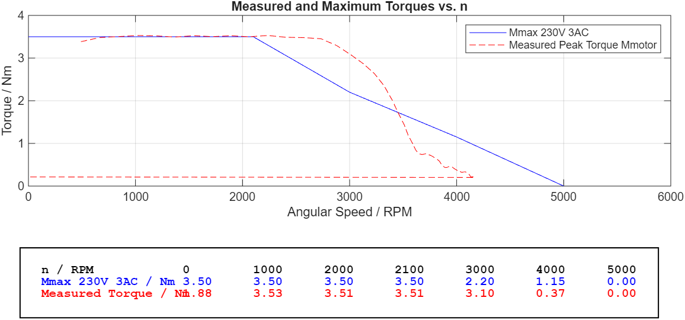
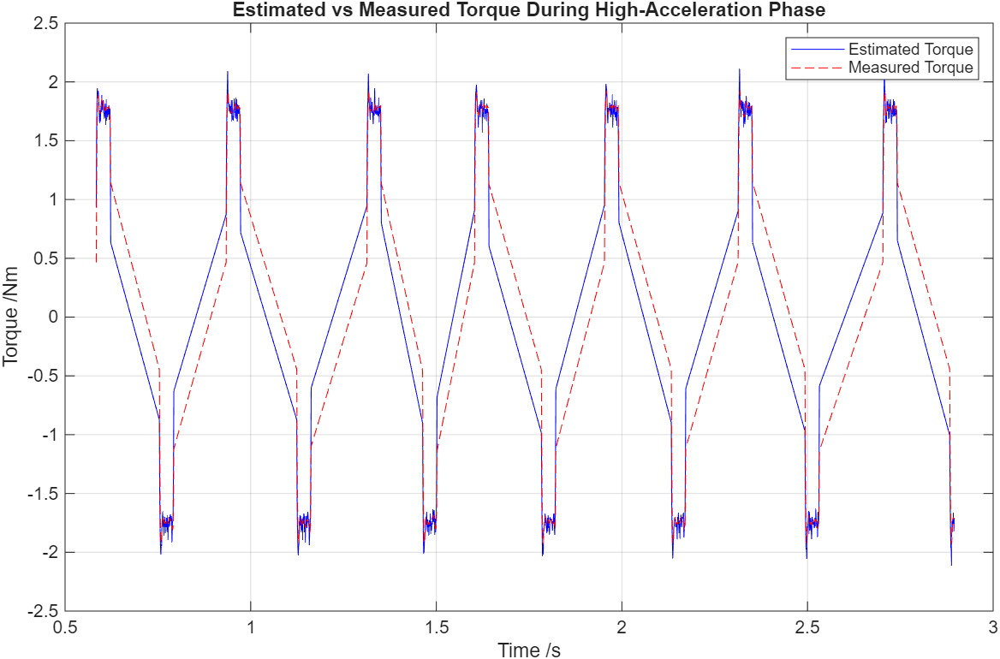
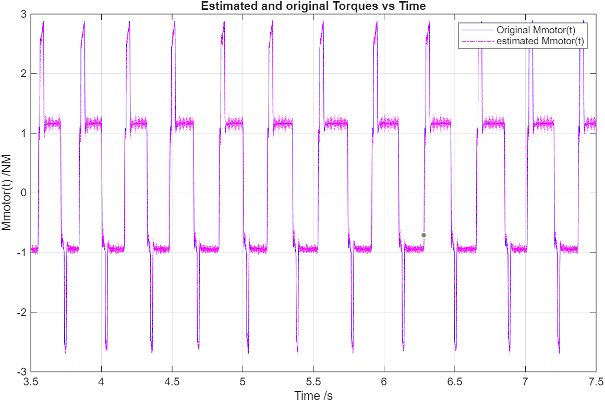

# MATLAB Control Systems

Collection of MATLAB labs and engineering exercises related to:
- Industrial drives
- System identification
- Motor modeling
- Friction estimation
- Numerical differentiation
- Dynamic system analysis

The repository contains coursework completed in robotics and automation engineering studies at THWS.

---

# Industrial Drives Lab

This lab focuses on analyzing servo motor behavior using measured trace data from industrial drive systems.

## Topics Covered

- Torque-speed characterization
- Load inertia estimation
- Friction modeling
- Numerical differentiation
- Least-squares parameter estimation
- Signal synchronization
- MATLAB data analysis and visualization

## Key Implementations

### Torque-Speed Analysis
Compared measured motor torque curves against manufacturer datasheet limits.

### Inertia Estimation
Estimated system inertia from angular acceleration and motor torque measurements.

### Friction Modeling
Modeled viscous and Coulomb friction using least-squares fitting.

### Signal Processing
Implemented reusable helper utilities for:
- trace synchronization
- numerical derivatives
- torque constant estimation

---

# Tools & Technologies

- MATLAB
- Industrial drive trace analysis
- Least-squares optimization
- Numerical modeling
- Data visualization

---

# Repository Structure

industrial-drives/
  - MATLAB source code
  - trace datasets
  - generated plots
  - final report

---

# Example Outputs

## Torque-Speed Characteristic

## High Acceleration-Torque Estimation

## Friction Model

---

## Control Systems Lab

This laboratory focuses on the analysis and design of feedback control systems using frequency-domain methods and simulation-based validation in MATLAB and Simulink.

### Topics Covered

- Transfer function modeling
- Frequency response analysis
- Bode diagram interpretation
- Controller design using phase margin and crossover frequency specifications
- P, PI, and PIDT1 controller tuning
- Closed-loop stability analysis
- Set-point tracking performance
- Disturbance rejection
- Dynamic performance evaluation
- DC motor speed control (ongoing)

### Key Implementations

#### Controller Design

Designed P, PI, and PIDT1 controllers using Bode-diagram methods to achieve specified phase margins and crossover frequencies.

#### Stability Verification

Validated controller parameters through MATLAB frequency-response analysis and margin verification.

#### Closed-Loop Simulation

Implemented controller-plant combinations in Simulink and evaluated:

- Rise time
- Settling time
- Overshoot
- Steady-state error
- Disturbance rejection performance

#### Comparative Controller Analysis

Compared the behavior of:

- P Controllers
- PI Controllers
- PIDT1 Controllers

across multiple plant models with different dynamic characteristics, including overdamped and underdamped systems.

### Tools & Technologies

- MATLAB
- Simulink
- Control System Toolbox
- Bode Analysis
- Frequency-Domain Design
- Feedback Control
- Dynamic System Modeling

### Example Outputs

#### Controller Margin Verification

Bode and margin plots used to validate controller stability requirements.

#### Set-Point Tracking

Comparison of closed-loop responses for P, PI, and PIDT1 controllers.

#### Disturbance Rejection

Analysis of controller robustness and recovery from external disturbances.

#### Performance Evaluation

Quantitative comparison using:

- Rise Time
- Overshoot
- Settling Time
- Steady-State Error

### Repository Structure

control-systems/

- MATLAB source code
- Simulink models
- generated plots
- laboratory reports
- controller design calculations

